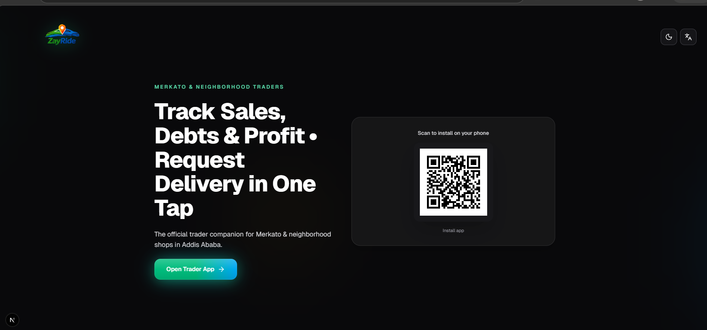

### About ZayRide

**ZayRide** is a smart, all-in-one mobile app designed for small traders and merchants .

It helps traders easily track **sales, expenses, debts, and daily profit** in Ethiopian Birr (ብር), while allowing them to request **fast and reliable delivery** directly through the ZayRide platform with just one tap.

By combining powerful record-keeping with seamless delivery integration, ZayRide turns everyday trading into a more organized, profitable, and efficient business helping merchants reduce losses from unpaid debts and poor tracking, while increasing delivery volume for the ZayRide ecosystem.

**Built for Merkato traders and neighborhood shops.**

### Key Features

- **Transactions**: Fast sales & expense tracking in ብር
- **Debt Management**: Record credit sales, track overdue payments, mark as paid
- **Real-time Profit**: Animated dashboard with daily net profit and 7-day trends
- **ZayRide Delivery Integration**: Add sale → Toggle "Request Delivery" → Animated driver assignment & live status updates
- **Smart Polish**: Voice input, Amharic support, export reports (CSV + PDF), offline-friendly (localStorage)
